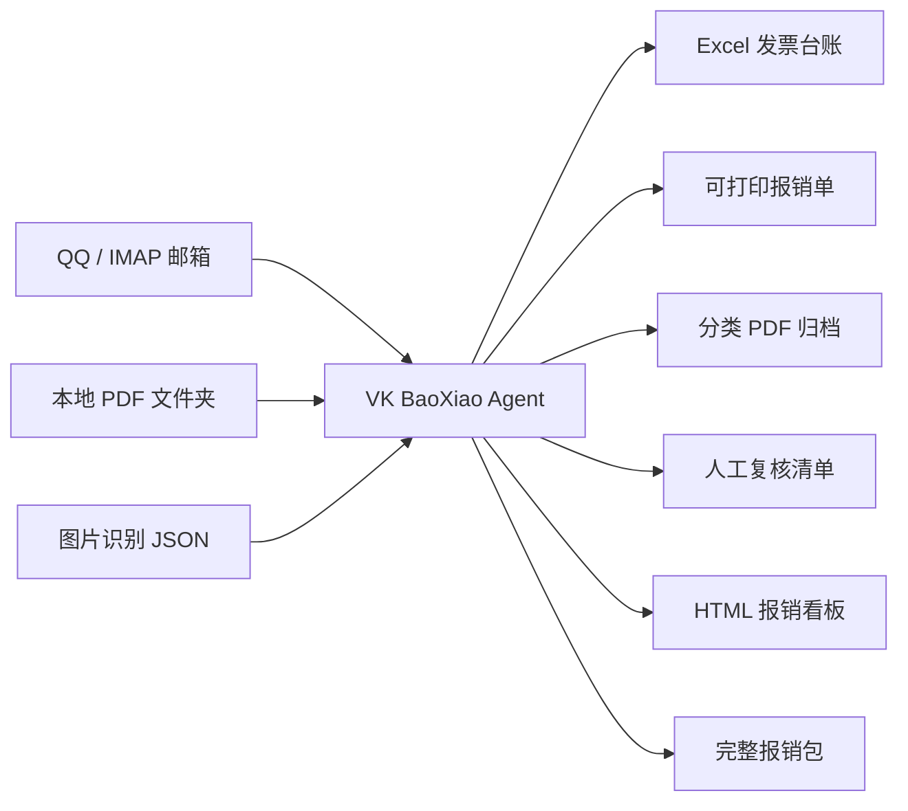
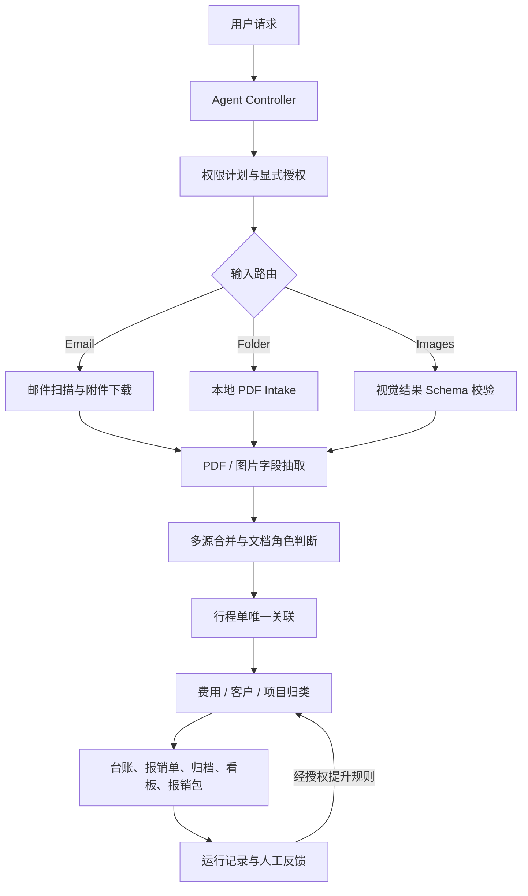
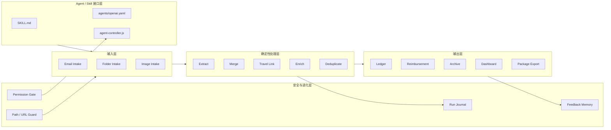

# VK BaoXiao Agent

> 第一次把报销模板和规则交给 AI；以后只给邮箱日期或发票文件夹地址，就自动识别、计算、分类、填写报销单并导出完整报销包。

**Local-first reimbursement invoice agent for email, PDF folders and vision-extracted images.**

维护者：[Vicky](https://x.com/vickyzhangtimes) · X：[@vickyzhangtimes](https://x.com/vickyzhangtimes) · 品牌：**VK Agent Lab**

[](https://github.com/vickyzhangtimes/vk-baoxiao-agent/actions)

[快速开始](#五分钟跑通) · [工作原理](#工作原理) · [系统架构](#系统架构) · [12 步流程](#12-步报销流水线) · [文档导航](#文档导航) · [安全说明](SECURITY.md)

当前版本：`v2.0.0` · Node.js `>=18` · Windows / macOS / Linux · `103/103` tests

如果它帮你少花一个晚上整理发票，欢迎点一个 **Star**。Star、Issue 和真实场景反馈会决定下一批优先支持的平台与票据格式。

---

## 它解决什么问题

报销真正麻烦的不是“做一张表”，而是材料散落、格式不同、信息缺失，以及每次都要重新判断：

- 发票在 QQ 邮箱、其他 IMAP 邮箱、本地文件夹和手机截图里。
- 发票、行程单、火车票等材料混在一起，不能重复计入金额。
- 同一个人同时处理多个客户、项目或费用类别。
- PDF 识别不完整，文件名又可能带金额，但不能直接当成财务真值。
- 最后还要生成 Excel 台账、可打印报销单、原件归档和出纳材料。

这个仓库把这些动作做成一条本地优先、可复核、可重复运行的 Agent 流水线。

适合：

- 每月需要自己整理报销材料的职场人。
- 自由职业者、顾问、一人公司和小团队。
- 同时管理多个客户、项目或成本中心的人。
- 希望由 AI 处理理解和异常，但由确定性脚本负责金额、去重、归档与导出的人。

Vicky 的典型用法是 Windows 本地运行、QQ 邮箱收票、本地 PDF 兜底、按客户和项目归类，并把最终报销包导出到指定磁盘目录。仓库只提供占位配置，不包含她的邮箱、公司税号、客户号、银行账户或真实发票。

## 核心能力

| 能力 | 结果 |
|---|---|
| 三种输入 | IMAP 邮箱、本地 PDF 文件夹、视觉 Agent 识别后的图片 JSON |
| 发票识别 | 购买方、销售方、金额、税额、发票号、开票日期、票种 |
| 差旅行程识别 | 机票/航空电子客票、火车票、网约车行程单、单段与多段 `legs` |
| 安全关联 | 行程单只在唯一候选时关联；同金额歧义进入人工复核 |
| 防重复 | 文件夹 PDF 按 SHA-256 去重；同名文件不会互相覆盖 |
| 业务归类 | 费用类别、客户类型、客户号、项目号、成本中心 |
| 完整输出 | Excel 台账、报销单、PDF 归档、HTML 看板、报销包 |
| 人工闭环 | 低置信度、文件名金额、缺字段和关联歧义统一进入清单 |
| Agent 控制 | 先展示权限计划，再执行；运行步骤和结果可追溯 |

## 核心体验：一次配置，以后自动跑

第一次使用时，可以直接把这些材料交给 AI：

- 公司现有的空白报销模板，或一张已经脱敏的历史报销单（`.xlsx`）。
- 公司报销制度、费用分类说明、审批要求等资料。
- 报销人、部门、公司抬头、税号、审批人等基础信息。
- 如果需要按业务核算，再提供客户号、项目号和成本中心规则。

AI 先读取材料，生成一份本地配置和带占位符的模板副本，向用户展示字段映射与分类规则；用户确认后保存为当前模板版本。原始模板不覆盖，真实配置、模板和资料不提交 Git。

完成第一次设置后，日常使用只需要一句话：

```text
用 VK BaoXiao Agent 处理 E:\本月报销，沿用我的公司模板和分类规则，
自动计算金额、按费用/客户/项目分类、填写报销单并导出完整报销包。
```

之后同一套模板、身份信息、费用规则和人工修正会持续复用。改过模板或规则时，流水线会自动重算受影响的步骤，不需要每个月重新配置。
## 输入与输出



图片模式不会自行调用固定云端 OCR。Codex、Claude Code、WorkBuddy 或其他具备视觉能力的宿主先按 [`references/image-intake-schema.md`](references/image-intake-schema.md) 生成结构化 JSON，本项目负责校验字段、置信度和后续流水线。

## 五分钟跑通

第一次使用建议选择本地 PDF 模式：把模板、规则资料和发票文件夹地址交给 AI，不需要先配置邮箱，也不需要 API Key。

### 1. 下载和安装

```powershell
git clone https://github.com/vickyzhangtimes/vk-baoxiao-agent.git
cd vk-baoxiao-agent
npm install
npm run init
```

也可以在 GitHub 点击 `Code → Download ZIP`，解压后进入项目目录。

不熟悉 Git 的用户建议直接选择 **Download ZIP**；熟悉 Agent Skill 的用户可以把整个仓库克隆到本机 skills 目录。

`npm run init` 只创建缺失的目录和本地配置，不覆盖已有文件。

### 2. 让 AI 完成第一次设置（推荐）

把现有报销模板和相关资料放在本地，然后对 Agent 说：

```text
请学习这张公司报销模板和报销规则，先列出你识别到的字段、费用分类和审批信息。
我确认后，再生成本地配置和模板副本；不要覆盖原件，不要上传或提交真实资料。
```

Agent 应完成：

1. 读取 `.xlsx` 报销模板或脱敏历史报销单，识别表头、明细行、合计、签字栏和审批字段。
2. 读取报销制度、分类表或项目资料，把稳定规则写入本地配置。
3. 生成带合法 token 的模板副本并做宏、外联公式和路径安全检查。
4. 展示“源字段 → 模板字段”和分类规则，取得确认后注册模板版本。
5. 设置 `REIMBURSEMENT_TEMPLATE`，让后续每次流水线自动填写同一张公司报销单。

完整模板规则见 [`docs/templates.md`](docs/templates.md)。

如果不想让 AI 读取模板，也可以手动编辑 `config/package-config.js`；普通职场人填写报销人、部门、公司抬头和审批信息，多项目用户再补客户号、项目号和成本中心。

### 3. 告诉 AI 发票文件夹地址

无需把 PDF 逐张上传到对话。把本月的普通发票、机票/航空电子客票、火车票和网约车行程单放在任意本地文件夹，然后把该文件夹的绝对路径告诉 Agent；可以包含多层子目录。


例如把路径告诉 AI：`E:\本月报销`。默认示例目录仍可使用 `input-invoices/`。

```powershell
npm run doctor -- --mode folder
npm run config:check
```

### 4. 先看计划，再运行

```powershell
npm run agent -- --folder input-invoices --date-tag first-run --plan

npm run agent -- --folder input-invoices --date-tag first-run `
  --approve filesystem.read-input,filesystem.clean,filesystem.write-output
```

### 5. 查看结果

优先检查：

```text
scan-results/发票台账-first-run.xlsx
scan-results/报销单-first-run.xlsx
scan-results/manual-tasks-first-run.csv
scan-results/报销看板-first-run.html
~/报销/<日期>_报销批次/
```

## 工作原理

Agent 负责理解用户目标、选择输入模式、生成权限计划和解释异常；Node.js 流水线负责金额、去重、匹配、Excel、归档和导出。



### 为什么它已经是 Agent，而不只是 Skill

| 层 | 作用 |
|---|---|
| `SKILL.md` | 告诉宿主 Agent 什么时候触发、如何执行、哪些判断不能越权 |
| `agent-controller.js` | 判断输入模式、生成计划、检查授权、记录运行状态 |
| `run-all.js` | 编排确定性的报销流水线 |
| `lib/` | 去重、路径安全、行程关联、字段规则和模板渲染 |
| `agent-memory/` | 保存本地反馈和规则候选，不提交 Git |
| 人工复核 | 对金额候选、低置信度和歧义关联保持 human-in-the-loop |

它具备目标理解、工具调用、状态记录、权限边界、异常升级和反馈学习，因此项目定位是“报销 Agent + 可安装 Skill”。

## 系统架构



更细的组件职责和信任边界见 [`docs/AGENT_ARCHITECTURE.md`](docs/AGENT_ARCHITECTURE.md)。

## 12 步报销流水线

| 步骤 | 阶段 | 主要动作 | 关键产物 |
|---:|---|---|---|
| 1 | Plan | 判断邮箱、文件夹或图片模式，展示权限计划 | run plan |
| 2 | Ingest | 扫描邮件、收取本地 PDF 或校验图片 JSON | emails / downloads |
| 3 | Normalize | 暂存 PDF、内容哈希去重、保留来源路径 | staging |
| 4 | Extract | 抽取购销方、金额、税额、号码、日期和路线 | pdf-text |
| 5 | Merge | 合并邮件、附件和识别结果，区分发票与配套凭证 | invoice-final |
| 6 | Enrich | 补费用类别、客户号、项目号和成本中心 | enriched records |
| 7 | Ledger | 生成多 Sheet Excel 发票台账 | 发票台账.xlsx |
| 8 | Reimbursement | 分组、小计、金额大写、签字栏、多段路线 | 报销单.xlsx |
| 9 | Archive | 按规则归档 PDF，保留全部原件 | archive/ |
| 10 | Build Table | 生成统一规范中间表和字段来源 | invoice-table.json |
| 11 | Export | 导出报销人和出纳双视角报销包 | 报销包目录 |
| 12 | Dashboard | 生成可离线打开的汇总看板 | 报销看板.html |

邮箱模式完整执行邮件扫描和下载；文件夹与图片模式从对应 Intake 进入，后续步骤共用。

## 行程单与金额安全规则

这是实跑后补上的核心边界：

- 正式发票使用 `recordRole=invoice`。
- 行程单和路线明细使用 `recordRole=supporting_document`。
- 配套凭证会归档，但不计入发票张数、待补发票分母和报销总额。
- PDF 正文没有金额时，文件名金额只保存为 `amountCandidate`。
- `FILENAME_AMOUNT_REVIEW` 必须人工确认后才能写入正式金额。
- 行程单结合金额、服务商、日期、来源目录和文件名进行关联。
- 只有唯一候选才自动关联；同金额多候选标记 `TRAVEL_LINK_AMBIGUOUS`。
- 多段路线统一存为 `legs`，在 Excel、HTML、Markdown 和看板中完整显示。

人工修改多段路线时，在 `pending-fill.csv` 的 `routeLegs` 中填写：

```text
上海虹桥站→客户公司 | 客户公司→酒店 | 酒店→上海虹桥站
```

## 三种运行模式

### 本地 PDF 文件夹

```powershell
npm run agent -- --folder "E:\待报销发票" --date-tag 2026-07 `
  --approve filesystem.read-input,filesystem.clean,filesystem.write-output
```

文件夹模式会：

- 递归收集 PDF。
- 按 SHA-256 去除完全相同的文件。
- 用哈希前缀保存同名文件，避免覆盖。
- 保留 `sourceRelativePath` 和 `sourceSha256` 便于追溯。

### QQ / IMAP 邮箱

先在本机录入授权码：

```powershell
npm run setup
npm run doctor -- --mode email
```

QQ 邮箱常用配置：

```text
IMAP_HOST=imap.qq.com
IMAP_PORT=993
IMAP_TLS=true
IMAP_REJECT_UNAUTHORIZED=true
MAILBOX=INBOX
```

再按日期范围运行：

```powershell
npm run agent -- 2026-07-01 2026-07-31 --plan
npm run agent -- 2026-07-01 2026-07-31 `
  --approve mail.read,network.download,filesystem.clean,filesystem.write-output
```

授权码只写入本地 `.env`，不要发到聊天窗口，也不要提交 Git。

### 发票图片或截图

```powershell
npm run doctor -- --mode images
npm run agent -- --images "C:\发票图片\extracted-invoices.json" --plan
npm run agent -- --images "C:\发票图片\extracted-invoices.json" `
  --approve filesystem.read-input,vision.process-images,filesystem.clean,filesystem.write-output
```

默认字段置信度阈值为 `0.85`。缺少置信度、字段不完整或低于阈值时，记录进入 `VISION_LOW_CONFIDENCE`，不会静默写入正式台账。

## 报销包结构

```text
<报销根目录>/<日期>_报销批次/
├── 00_说明.txt
├── 01_发票原件/
│   ├── 差旅交通/
│   ├── 住宿/
│   ├── 餐饮招待/
│   └── ...
├── 02_报销人视角/
│   ├── 报销单.xlsx
│   ├── 报销单.html
│   ├── 报销单.md
│   ├── 报销清单.md
│   └── 待补齐项.md
├── 03_出纳视角/
│   ├── 费用类别汇总.xlsx
│   ├── 付款凭证模板.html
│   ├── 发票合规检查清单.html
│   └── 附件完整性核对.md
├── 04_总览看板.html
└── 05_原始数据/
```

修改导出位置：

```powershell
$env:REIMBURSE_ROOT = 'E:\报销'
```

## 人工复核闭环

生成待处理清单：

```powershell
node fill-pending.js --init
```

在 Excel 中补充或确认 `knownAmount`、`invoiceNo`、`invoiceDate`、`buyer`、`routeLegs`、`pdfPath`，保存后运行：

```powershell
node fill-pending.js
```

人工修正会写入本地 `invoice-overrides-{dateTag}.json`，重跑台账、报销单、看板和导出包时继续生效。

## 项目目录

```text
vk-baoxiao-agent/
├── SKILL.md                      # Agent 触发与执行规则
├── agents/openai.yaml            # Codex Skill 展示信息
├── agent-controller.js           # 模式路由、权限计划、运行记录
├── run-all.js                    # 12 步流水线编排
├── step*.js                      # 抽取、合并、归类、台账、报销单
├── ingest-folder.js              # 本地 PDF Intake
├── ingest-images.js              # 图片 JSON Intake
├── archive-invoices.js           # PDF 归档
├── export-to-edrive.js           # 完整报销包导出
├── lib/
│   ├── record-utils.js           # 发票角色与路线统一格式
│   ├── travel-link.js            # 行程单唯一关联
│   ├── folder-intake.js          # SHA-256 去重与安全命名
│   ├── permission-gate.js        # 权限闸门
│   ├── path-guard.js             # 路径安全
│   ├── url-policy.js             # 下载 URL 安全
│   └── run-journal.js            # 运行日志
├── config/                       # 示例规则与本地配置入口
├── references/                   # Agent 按需读取的字段契约
├── docs/                         # 用户与开发文档
└── test/                         # Node.js 回归测试
```

## 文档导航

| 文档 | 适合什么时候读 |
|---|---|
| [`SKILL.md`](SKILL.md) | 作为 Codex / Claude Code / WorkBuddy Skill 安装或调用 |
| [`docs/AGENT_ARCHITECTURE.md`](docs/AGENT_ARCHITECTURE.md) | 理解 Controller、权限、记忆和信任边界 |
| [`docs/AGENT_WORKFLOW.md`](docs/AGENT_WORKFLOW.md) | 理解各步骤输入、输出和人工节点 |
| [`docs/PROJECT_DESIGN.md`](docs/PROJECT_DESIGN.md) | 理解数据模型、去重和归档设计 |
| [`docs/templates.md`](docs/templates.md) | 把现有公司报销模板接入自动填写流水线 |
| [`CUSTOMIZE.md`](CUSTOMIZE.md) | 修改个人、公司、客户、项目和费用规则 |
| [`references/image-intake-schema.md`](references/image-intake-schema.md) | 接入视觉模型或图片识别 Agent |
| [`SECURITY.md`](SECURITY.md) | 查看隐私边界、漏洞报告和安全约束 |
| [`CONTRIBUTING.md`](CONTRIBUTING.md) | 提交代码、规则或测试 |
| [`CHANGELOG.md`](CHANGELOG.md) | 查看版本变化和真实场景修复 |

## 作为 Agent Skill 安装

把仓库克隆到所用 Agent 的 skills 目录，或让 Agent 读取本仓库的 `SKILL.md`。

典型请求：

```text
使用 vk-baoxiao-agent，先展示权限计划，
再整理我指定文件夹中的发票和行程单。
生成台账、报销单和报销包，并列出所有需要人工确认的项目。
```

Skill 的规则是给 Agent 读的；README 是给 GitHub 用户看的。两者职责不同，详细架构和长说明放在 `docs/`，避免 `SKILL.md` 占用过多上下文。

## 配置与隐私

| 文件 / 目录 | 内容 | 提交 Git |
|---|---|---:|
| `config/package-config.js` | 报销人、公司抬头、税号、审批和账户 | 否 |
| `.env` | 邮箱地址和授权码 | 否 |
| `agent-memory/` | 本地反馈、精确修正和规则候选 | 否 |
| `scan-results/` | 识别结果、台账和人工任务 | 否 |
| `archive/` | 真实发票与归档结果 | 否 |
| `input-invoices/` | 本地待处理 PDF | 否 |
| `config/*.example.*` | 占位配置 | 是 |

邮件下载默认只允许公网 HTTPS，并限制私网地址、重定向和响应大小。路径清理与导出使用越界守卫。正式报销、入账、纳税申报和审计材料仍需人工复核。

本项目提供材料整理辅助，不提供财务、税务、法律或审计意见。

## 开发与验证

```powershell
npm run check
npm test
npm run config:check
npm run doctor -- --mode folder
```

当前发布候选：

- JavaScript syntax：通过
- Node.js tests：`103/103`
- Skill `quick_validate`：通过
- `npm pack --dry-run`：通过
- GitHub Actions：Node.js 18 / 20 / 22
- `npm audit`：0 vulnerabilities

## 贡献与反馈

- 觉得有用：点一个 **Star**，让更多需要整理报销材料的人能看到它。
- 不会安装：提交 Issue，并注明 Windows / macOS / Linux、Node.js 版本和所用输入模式。
- 遇到新票据：只提交脱敏样本或合成复现材料，不要上传真实发票。

- Bug 和功能建议：GitHub Issues
- 代码与规则：Pull Request
- 安全问题：按 [`SECURITY.md`](SECURITY.md) 私下报告，不要公开真实发票或邮箱配置
- 提交前请使用脱敏、合成测试数据，不要上传真实税号、账户、客户号或发票

## 维护与致谢

维护者：[Vicky / @vickyzhangtimes](https://x.com/vickyzhangtimes) · VK Agent Lab。

本项目基于「aigc猎手竹相左边」发布的 MIT 上游版本继续开发，并由 Codex、DeepSeek、QClaw、WorkBuddy 等工具参与生成、测试与真实场景修复。准确版权与上游说明见 [`LICENSE`](LICENSE)。

## License

[MIT](LICENSE)
