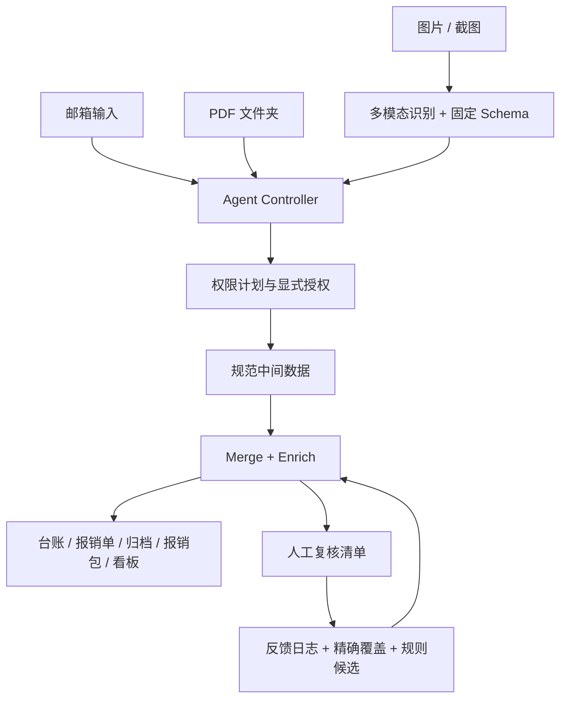

# VK BaoXiao Agent 架构

## 边界

本项目是一个本地优先的VK BaoXiao Agent，也能作为 Codex、Claude Code、WorkBuddy 的 Skill 安装。Agent 负责输入路由、权限确认、视觉识别、异常处理和反馈回写；Node.js 流水线负责金额、合并、去重、归档、Excel 与看板等确定性计算。

## 六层结构

1. 方法论层：PDF/视觉证据优先，去重宁多勿漏，高风险动作显式授权。
2. 流程层：三种输入进入同一规范中间数据和下游链路。
3. 执行层：`agent-controller.js` 编排，`run-all.js` 执行确定性步骤。
4. 模板层：图片 schema、报销模板、配置示例和反馈 JSON。
5. 记忆层：`agent-memory/` 保存反馈、精确覆盖和规则候选，本地使用且不提交 Git。
6. 进化层：候选规则先记录，只有取得 `rules.write` 授权才提升到正式分类规则。

## 权限

- 邮箱：`mail.read`、`network.download`、`filesystem.clean`、`filesystem.write-output`
- PDF 文件夹：`filesystem.read-input`、`filesystem.clean`、`filesystem.write-output`
- 图片：`filesystem.read-input`、`vision.process-images`、`filesystem.clean`、`filesystem.write-output`
- 规则提升：`rules.write`

先运行 `npm run agent -- <参数> --plan` 查看计划，再用 `--approve scope1,scope2` 明确授权。授权和每一步状态写入 `scan-results/runs/`。
